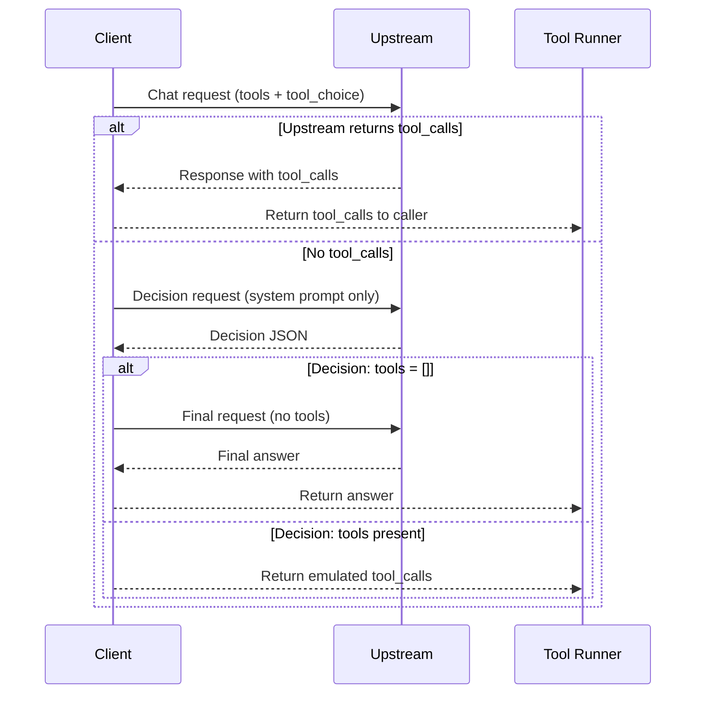
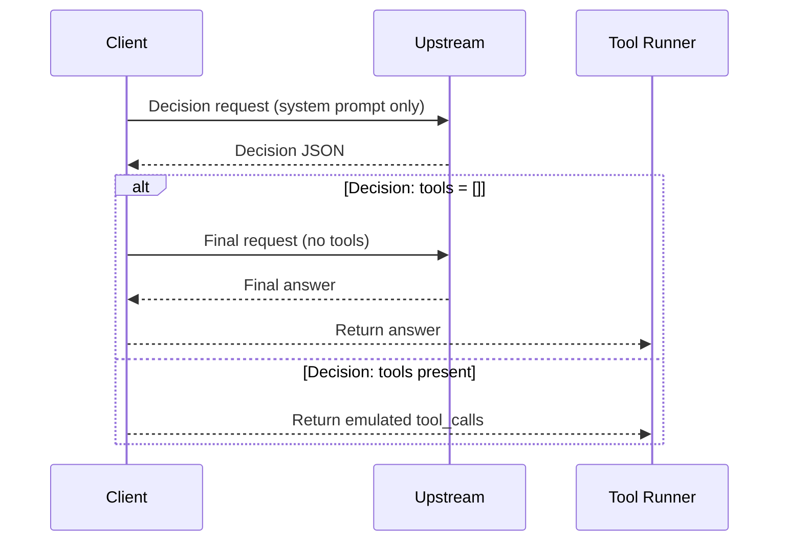

# Tool Emulation Flow

This document describes the current tool-emulation behavior in `uniai` as implemented in `tool_emulation.go`.

## Emulation Modes

`ToolsEmulationMode` controls whether and how emulation is used:

- `ToolsEmulationOff` (default): no emulation. Only upstream tool calling is used.
- `ToolsEmulationFallback`: try upstream tool calling first, then emulate if no `tool_calls`.
- `ToolsEmulationForce`: skip upstream tool calling and always emulate.

| Mode | Upstream tool calling | Emulation | Requests if tools needed* | Requests if no tools needed* |
| --- | --- | --- | --- | --- |
| ToolsEmulationOff | Yes | No | 2 | 1 |
| ToolsEmulationFallback | Yes (first) | Yes (only if no tool_calls) | 2–3 | 1–2 |
| ToolsEmulationForce | No | Yes | 2 | 2 |

*\* “Requests” counts only LLM calls. It does not include the actual external tool execution.\n\n*

Recommended usage:

- **ToolsEmulationOff**: use when the upstream provider reliably supports tool calling.
- **ToolsEmulationFallback**: use when provider support is uncertain or mixed.
- **ToolsEmulationForce**: use when the upstream provider does not support tool calling.

## When Emulation Runs

- **ToolsEmulationOff**: never runs.
- **ToolsEmulationFallback**: runs only when the request includes tools **and** the upstream response contains no `tool_calls`.
- **ToolsEmulationForce**: runs whenever the request includes tools (no upstream tool-calling attempt).

## Sequence Diagram

### ToolsEmulationFallback

### ToolsEmulationForce

## Detailed Flow (ToolsEmulationFallback)

1) **Initial upstream request**
   - The client sends the original request (including `tools` and `tool_choice`) to the upstream provider.
   - If `tool_calls` are present in the response, the client returns immediately.
   - If no `tool_calls` are present, continue to emulation.

2) **Build + send tool-decision request**
   - A new system prompt is generated that:
     - forces a strict JSON-only output format;
     - defines the allowed tool list and their JSON schemas;
     - includes any `tool_choice` constraint (none/required/function).
   - The request is cloned, then:
     - all existing **system** messages are removed;
     - all prior `role=tool` messages are removed;
     - all assistant messages except the **latest** are removed;
     - if the latest assistant message has `tool_calls`, they are cleared;
     - `tools` and `tool_choice` are cleared;
     - the decision prompt is inserted as the only system message.

   - The decision request is sent to the same provider.

3) **Enforce tool_choice**
   - The remaining tool decision is validated against `tool_choice`:
     - `none` rejects all tool calls.
     - `required` requires at least one tool call.
     - `function` requires exactly one call to the named tool.

4) **Branch: no tools**
   - If the decision indicates no tools, the client issues a second request:
     - original messages;
     - `tools` and `tool_choice` removed.
   - The final assistant response is returned.
   - `Warnings` includes `"tool calls emulated"`.

5) **Branch: tool calls**
   - Each emulated tool call is converted into a `ToolCall` with an ID like
     `emulated_<unix_nano>_<idx>`.
   - The response returns **only** `ToolCalls` (no assistant text).
   - `Warnings` includes `"tool calls emulated"`.

## Detailed Flow (ToolsEmulationForce)

1) **Build + send tool-decision request**
   - A new system prompt is generated that:
     - forces a strict JSON-only output format;
     - defines the allowed tool list and their JSON schemas;
     - includes any `tool_choice` constraint (none/required/function).
   - The request is cloned, then:
     - all existing **system** messages are removed;
     - all prior `role=tool` messages are removed;
     - all assistant messages except the **latest** are removed;
     - if the latest assistant message has `tool_calls`, they are cleared;
     - `tools` and `tool_choice` are cleared;
     - the decision prompt is inserted as the only system message.

   - The decision request is sent to the same provider.

2) **Enforce tool_choice**
   - The remaining tool decision is validated against `tool_choice`:
     - `none` rejects all tool calls.
     - `required` requires at least one tool call.
     - `function` requires exactly one call to the named tool.

3) **Branch: no tools**
   - If the decision indicates no tools, the client issues a second request:
     - original messages;
     - `tools` and `tool_choice` removed.
   - The final assistant response is returned.
   - `Warnings` includes `"tool calls emulated"`.

4) **Branch: tool calls**
   - Each emulated tool call is converted into a `ToolCall` with an ID like
     `emulated_<unix_nano>_<idx>`.
   - The response returns **only** `ToolCalls` (no assistant text).
   - `Warnings` includes `"tool calls emulated"`.

## Tool Execution

Tool execution is **not** automatic. The caller must:

1) Execute the tool(s) from the returned `ToolCalls`.
2) Send tool results back via `RoleTool` messages.
3) Call `Chat` again to obtain the final assistant response.

## Notes / Limitations

- Only tools of type `function` are included in the decision prompt.
- The decision parser is tolerant of extra text, but if no valid tool JSON is found:
  - it returns a "no tools" decision (unless `tool_choice` forbids that).
- Emulation depends on model compliance with the decision prompt.
